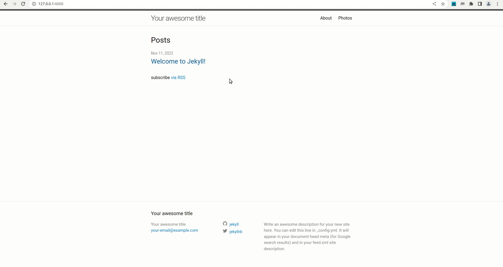
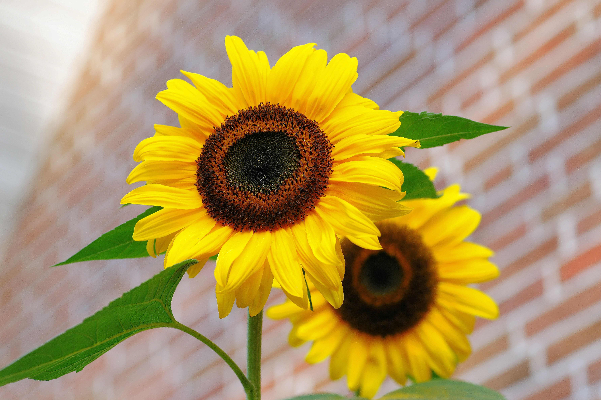
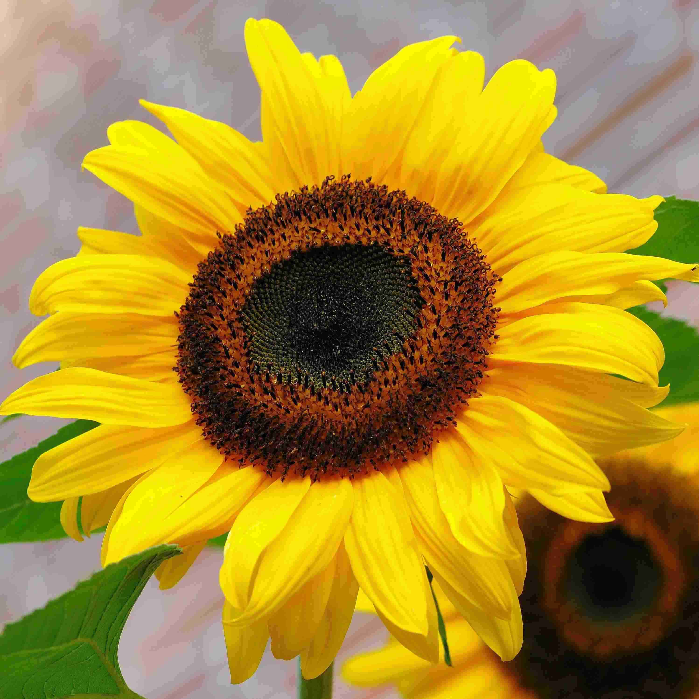
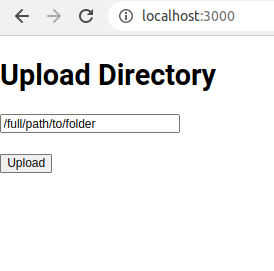
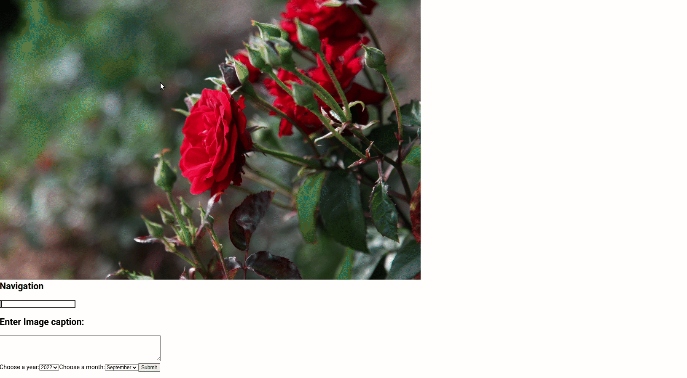

# jekyll-gallery-tags

This repository hosts the code for a photo gallery addition to [Jekyll based sites](https://jekyllrb.com/). It is assumed the user is familiar with Jekyll site generation as it can be quite involved. It is recommended user has basic knowledge of the Jekyll sites, installing required packages, terminals and (_of course_) patience to do some minor debugging as a result of the user's computer environment being different from my development environment. The code here was tested and developed on a Ubuntu machine.

The repository's code generates two types of pages.

The first page type is the home page. There is only one home page generated and it showcases all the various themes (or tags) in your photo gallery. The home page links to the tag pages via thumbnails. In the gif below, the home page is the "photos" page.



The second page type is the tag page and is linked from the home page. The tag page is ordered by date with images laid out in square formation. Clicking the square thumbnails loads the full image and its caption. 


The goal of this repository is to provide a statically generated photo gallery that is good for organizing your photos in a visually appealing way. Ideally, this visually appealing gallery way will make it more enjoyable to share images and therefore take new pictures.


The square thumbnails seen in the tag page are to be generated by the user manually. This is what significantly distinguishes this photo gallery from others such as [jekyll-photo-gallery](https://github.com/aerobless/jekyll-photo-gallery). The square previews of an images are meant to entice the gallery viewers to view the full image and for the photographer to choose which part of the image stands out most to them. In addition, square thumbnails present an efficient way in organizing your gallery images compactly.

   | Original Image             |  Thumbnail |
   |:-------------------------|:-------------------------|
   |  |  |

In the sections below we will learn how to
 - Add the gallery to your site
    - How to configure the `_config.yml` file and what files need to be added in the directory of your site
 - Generate the thumbnails to your site
    - This is optional but useful in case you need a nice browser based tool to generate your thumbnails for the tag pages
 - How to test these changes on a local basic repository
    - And other useful discussions

## Add the gallery to your site

In the root repository of your jekyll based site you have a `_config.yml` file. Modify it to include

```
gallerytags:
  dir: <photos>
  galleries:
    - <tag1>
    - <tag2>
    - <tag3>
```

The values of `<photos>` and `<tagN>` correspond with

```
├── _config.yml
├── ...
├── <photos>
│   ├── <tag1>
│   │   ├── some_tag1_image1.jpg
│   │   ├── some_tag1_image2.jpg
│   │   ├── some_tag1_image3.jpg
│   │   ├── ...
│   │   ├── result.yml
│   │   ├── thumbnail
│   │   │   ├── some_tag1_image1_thumbnail.jpg
│   │   │   ├── some_tag1_image2_thumbnail.jpg
│   │   │   ├── some_tag1_image3_thumnbnail.jpg
│   │   │   ├── ...
│   ├── <tag2>
│   │   ├── ...
```

The root of your Jekyll site will have a `<photos>` folder which will store all of your tags as subfolders `<tag1>`, `<tag2>`... . You can choose the word you want for `<photos>` and `<tag>` - it will be reflected in the page URL path. You must include a `result.yml` file within each `<tag>` folder which helps link a square thumbnail to a given image as well as specify a picture's date and caption. Here is a sample `result.yml`: 

```
cover: thumbnail/image_1_thumb.jpg
summary: These pictures were taken in 2018 during my vacation
images:
- caption: 'This is the caption'
  month: '7'
  name: image_1.jpg
  thumbnail: thumbnail/image_1_thumb.jpg
  year: '2018'
- caption: ''
  month: '8'
  name: image_2.jpg
  thumbnail: thumbnail/image_2_thumb.jpg
  year: '2018'
```

The `thumbnail` subfolder is not necessary but a clean way to separate your square thumbnails and images (you could keep your thumbnails in `<tag>`). The `result.yml` (required name) has three entries: 
 - `cover`: is the relative path to the thumbnail that will represent your tag in the homepage
 - `summary`: is the brief description of the uniting theme of the images
 - `images`: is an array where each entry has
   - `caption`: the caption of the image
   - `thumbnail`: the relative path to the thumbnail. There is no requirement to have the image named in a specific way or put in a specific folder (as long as it is within `<tag>`).
   - `month`: one of `1,2,3,4,5,6,7,8,9,10,11,12` wrapped in single quotations
   - `year`: A positive integer wrapped in single quotations (assuming your pictures are from `19XX` to `20XX` but technically you could past any integer).

Now that you have gathered the `<photo>` and various `<tagN>` subfolders along with the pictures and `result.yml`s then you are ready to generate your website. Copy the files from this repository to the `_plugins` directory:

```
cp jekyll-gallery-tags/lib/* <your_site_dir>/_plugins
``` 

If the `_plugins` folder does not exist then create it. Now you can generate your site:

```
jekyll build; jekyll serve --trace
```

You will be able to see the results in
 - `<site_url_or_localhost>/<photos>`
 - `<site_url_or_localhost>/<photos>/<tagN>`

## Generate the thumbnails to your site

The square thumbnails give this photo gallery a unique visual appeal. The trade off with this is that you will have to generate the square thumbnails yourself. You will have to go through each image and choose which part stands out to you as a good representation or advertisement of the image. A tool has been created for to assist with this. The tool is located in the `generate_boxes` in the root of this repository.


Say you have photos in a some folder `/full/path/to/folder`. In one terminal:

```
cd generate_boxes/backend
export FLASK_APP=tag.py
flask run
```

and in another terminal:

```
cd generate_boxes/site
npm start
```

Now you have a backend and front end (respectively) running to produce a web app that will assist in creating square thumbnails. Based on the output of `npm start` open up the url (for me it is `http://localhost:3000/`):



After pressing `upload`, you will be redirected to a page where you can click and drag to make the square thumbnail (right image is the preview of the square thumbnail), add a caption and date.



You can go through every picture in `/full/path/to/folder` and process each picture. This will create a folders `thumbnail` and `thumbnail_info` within `/full/path/to/folder` with the former containing thumbnails and the latter containing other information stored in json format. (You can use the navigation input with letters `n` or `b` to go forward or backward and `=` to wipe the navigation input bar.)

Once you are done, open a third terminal window and run:
```
cd generate_boxes/backend/
python script.py
```

which will ask you to provide two directories for which you will provide:
```
/full/path/to/folder/thumbnail_info
```
and for next input:
```
/full/path/to/folder
```
which will generate the `result.yml` file within `/full/path/to/folder`. Make sure to add `summary` and choose the best thumbnail for `cover` parameters to `result.yml` file as discussed in previous section.

Now the `/full/path/to/folder` folder is ready to be placed within your Jekyll site's `<photos>` folder with its just generated `thumbnail` and `result.yml` intact.


## How to test these changes on a local basic repository

In this repository I have created a test site of my the photo gallery plugin in `test_site`. The two gifs at the beginning of this README demonstrate this site. I have created the site by running

```
cd test_site
jekyll new .
```

which creates a generic blank default site. I have then copied over the plugin code from this repository to the test site.

```
cd ..
mkdir -p test_site/_plugins 
cp lib/* test_site/_plugins/
cd test_site
jekyll serve --trace; cd -
```

which will generate the site. In addition, I have made a small modification to the default site to exclude the tag pages from the header navigation bar (based on [this](https://mycyberuniverse.com/exclude-pages-from-navigation-menu-in-jekyll.html)). I have created an additional folder within `test_sites` called `_includes/` and added the file `header.html` explicitly from which the minima site used here draws its theme. Within `header.html`, I have replaced 

```
<a class="page-link" href="{{ my_page.url | relative_url }}">{{ my_page.title | escape }}</a>
```

with

```

<a class="page-link" href="{{ my_page.url | relative_url }}">{{ my_page.title | escape }}</a>

```

I have left the site as part of the repository so that you do not have to recreate it and can just run

```
cd test_site
jekyll serve --trace
```

Sample images for test photo gallery are from [here](https://www.pexels.com/search/skyscraper/).

### Image tip:

For best page rendering, it is recommended that images be not excessively large. To achieve this, you may need to use ImageMagick to compress your images:

```
cd /full/path/to/folder/thumbnail
for FILE in *; do convert $FILE -define jpeg:extent=200kb $FILE; done
```

(note: convert here used with jpeg files)

## Future Work:

 - Add multiple images under a single thumbnail. This would be well suited for recipes.
 - Potentially add some sort of pagination or dynamic loading so that we don't have to load all image thumbnails at once. 

## Additional reading on how to create a plugin
 - https://michaelcurrin.github.io/code-cookbook/recipes/jekyll/plugins/generators.html
 - https://github.com/ggreer/jekyll-gallery-generator/blob/3eede2a5026836ea86ae869b6b9c8b0522695026/lib/gallery_page.html
 - https://maxchadwick.xyz/blog/building-a-custom-jekyll-command-plugin
 - https://ayastreb.me/writing-a-jekyll-plugin/
